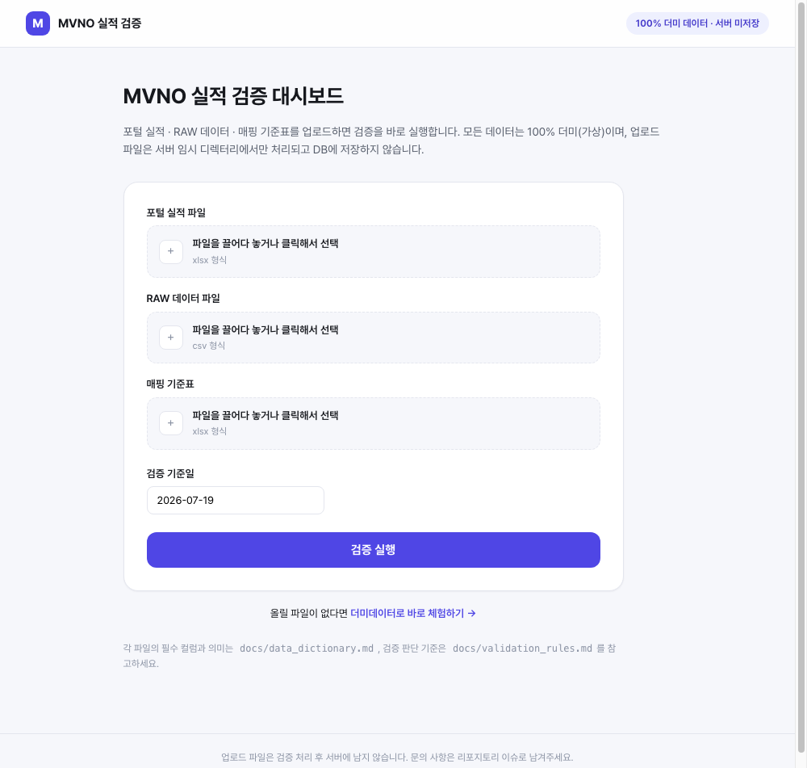
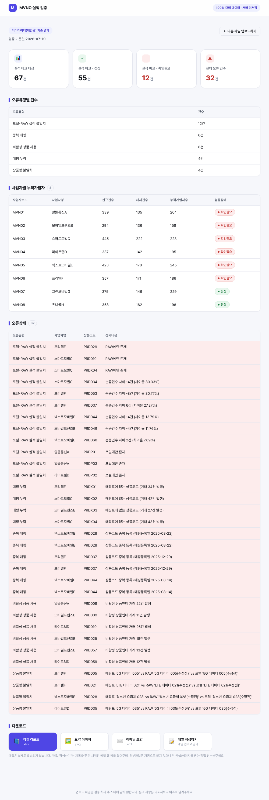

# MVNO 실적 데이터 검증 및 리포트 자동화 프로젝트

> ⚠️ 본 프로젝트는 포트폴리오 목적으로 제작되었으며, 모든 데이터는 100% 더미(가상)입니다.
> 실제 회사명, 파트너명, 상품명, 컬럼명을 사용하지 않았습니다.

🔗 **라이브 데모**: [report-automation-dun.vercel.app](https://report-automation-dun.vercel.app)
(더미데이터로 바로 체험 가능, 업로드 파일은 서버에 저장되지 않습니다)

## 배경

통신사 MVNO 사업 운영 환경에서 발생할 수 있는 반복적인 실적 검증 업무를 가상의 시나리오로
구성했습니다. 포털 실적 파일, RAW 데이터, 상품 매핑 기준표가 별도로 존재한다고 가정하고,
사람이 수기로 비교하던 데이터 정합성 확인 과정을 Python 스크립트로 자동화했습니다.

다루는 검증 시나리오는 다음 4가지입니다.

- 실시간 실적 공지 (포털 실적 vs RAW 데이터 대사)
- 요금제/상품 미매핑 현황 점검
- 사업자별 누적 가입자 집계 (규제기관 제출용)
- 실적 요약 이메일 공지 (고정 문구 + 요약 이미지·엑셀 첨부)

## 검증 리포트 구성

단순 집계표가 아니라 "어떤 데이터가 왜 이상한지"가 드러나도록, Excel 리포트를 5개 시트로 구성했습니다.

| 시트 | 내용 |
|---|---|
| 요약 | 검증 기준일, 실적비교 정상/확인필요 건수, 오류유형별 건수, 전체 누적가입자수 |
| 실적비교 | 포털 vs RAW를 사업자/상품 단위로 대사한 전체 내역 (차이·차이율·검증상태 포함) |
| 요금제미매핑이슈 | 매핑누락/중복/비활성사용/명칭불일치 4종을 상품코드·오류유형·상세내용으로 통합 |
| 오류상세 | 실적비교 이상 항목 + 매핑 이슈 전체를 하나의 오류 목록으로 합친 시트 |
| 사업자별누적가입자 | 사업자별 신규/해지/누적가입자수 + 검증상태(정상/확인필요) |

이상 항목은 빨간 배경으로 강조되며, 텍스트 요약과 PNG 이미지에도 같은 검증상태가 함께 표시됩니다.

## Data Dictionary & Validation Rules

자동화 로직이 입력 데이터를 일관되게 해석할 수 있도록, 입력 파일별 컬럼 의미와 검증 기준을
문서로 분리해 관리합니다. 컬럼명이나 판단 기준이 바뀌면 코드와 함께 이 문서도 갱신합니다.

- [`docs/data_dictionary.md`](docs/data_dictionary.md): 포털 실적/RAW/매핑 기준표 3개 파일의
  컬럼명·업무 의미·예시값·필수 컬럼 정의
- [`docs/validation_rules.md`](docs/validation_rules.md): 포털-RAW 대사 기준, 매핑 오류 4종
  분류 기준, 사업자 단위 확인필요 판단 기준 정의

웹 대시보드의 파일 업로드 검증도 이 문서의 필수 컬럼 목록(`web/app.py`의
`REQUIRED_COLUMNS`)을 그대로 기준으로 삼습니다. 실적 공지 업무는 파일 형식과 검증 기준이
고정된 반복 업무이므로, 데이터 정의와 검증 규칙을 먼저 문서화한 뒤 그 기준으로 로직을
구현했습니다.

## 이메일 초안 자동 생성

실무에서는 매번 같은 문구("안녕하십니까, OOO팀입니다. ~마감 실적 공유드립니다. 감사합니다.")로
요약 스크린샷과 엑셀 파일을 첨부해 메일로 공지하는 작업이 반복됩니다. 이 프로젝트는 제목·본문·첨부까지
채워진 `.eml` 파일을 생성해서 메일 클라이언트(Outlook, Mail 등)에서 더블클릭하면 바로 '보내기'만
누르면 되는 상태로 만들어 줍니다.

실제 SMTP 발송/사내 메일 인증정보 연동은 의도적으로 넣지 않았습니다. 자격증명을 코드에 두는 것도
위험하고, 자동으로 실제 메일이 발송되는 것도 사람이 확인 없이는 위험한 동작이라 판단했습니다.
웹 대시보드에도 발송 버튼은 없고, 다운로드까지만 지원합니다.

## 웹 서비스: FastAPI API + Vue 프론트엔드

CLI와 동일한 검증 파이프라인을 FastAPI **JSON API**로 감싸고, 그 위에 별도의 **Vue 3 + Vite SPA**를
프론트엔드로 붙였습니다. 백엔드는 화면을 그리지 않는 순수 API이고, 프론트는 API만 호출해서 화면을
구성합니다. 데이터를 영구 저장하거나 메일을 발송하는 기능은 없는 읽기 전용(read-only) 서비스입니다.

```bash
# 터미널 1: 백엔드 API
uvicorn web.app:app --reload            # http://localhost:8000

# 터미널 2: 프론트엔드
cd frontend && npm install && npm run dev   # http://localhost:5173
```

사용자는 [`docs/data_dictionary.md`](docs/data_dictionary.md)에 정의된 형식으로 3개 파일을
업로드합니다.

| 입력 파일 | 형식 | 설명 |
|---|---|---|
| 포털 실적 파일 | `.xlsx` | 사업자/상품 단위 월간 실적 |
| RAW 데이터 파일 | `.csv` | 신규/해지 거래 원천 데이터 |
| 매핑 기준표 | `.xlsx` | 요금제/상품-사업자 매핑 마스터 |

업로드된 파일은 서버 임시 디렉터리에서만 열어서 검증 파이프라인에 전달하고, DB에는 저장하지
않습니다. 필수 컬럼이 없으면 검증을 실행하지 않고 어떤 컬럼이 빠졌는지 바로 알려줍니다.

**백엔드 API** (`web/app.py`, 순수 JSON — HTML을 그리지 않음)

| 라우트 | 메서드 | 내용 |
|---|---|---|
| `/api/validate` | POST | 3개 파일 업로드 → 검증 실행 → 요약 JSON 반환 (job_id 포함) |
| `/api/summary/{job_id}` | GET | 검증 요약 JSON (`demo`는 항상 존재하는 체험용 job) |
| `/api/errors/{job_id}` | GET | 오류상세 JSON |
| `/download/{job_id}/{xlsx\|png\|eml}` | GET | 해당 건의 산출물 다운로드 |
| `/health` | GET | 헬스체크 |

**프론트엔드** (`frontend/`, Vue 3 + Vite)

| 컴포넌트 | 역할 |
|---|---|
| `App.vue` | 업로드 화면/결과 화면 전환, `?job=<id>`로 특정 결과 딥링크 |
| `UploadForm.vue` | 3개 파일 + 기준일 업로드 폼, `/api/validate` 호출 |
| `Dashboard.vue` | `job_id` 기준으로 summary/errors를 불러와 렌더링 |
| `SummaryCards.vue` / `OperatorTable.vue` / `ErrorTable.vue` | 요약 카드 / 사업자별 상태 / 오류상세 표 |

업로드 화면과 결과 화면 (`?job=demo`로 더미데이터 결과를 바로 볼 수 있습니다):





로컬 개발에서는 프론트(`:5173`)와 백엔드(`:8000`)가 다른 포트라 CORS를 열어 두었습니다
(`web/app.py`의 `CORSMiddleware`, 인증/쿠키가 없는 데모 API라 오리진을 넓게 허용해도 리스크가 낮습니다).

Vercel 배포는 `vercel.json`에서 두 빌드를 함께 구성합니다: `api/index.py`(FastAPI 앱을 재노출하는
진입점, `@vercel/python`)와 `frontend/`(정적 빌드, `@vercel/static-build`). `/api/*`, `/download/*`,
`/health`는 API로, 나머지는 프론트 정적 파일로 라우팅됩니다. 서버리스 환경에서는 job이 프로세스
메모리에만 유지되므로, 콜드 스타트가 나면 이전 업로드 결과가 사라질 수 있습니다 (DB 없이 임시
처리하는 구조의 트레이드오프이며, `demo` job은 서버 시작 시 항상 다시 계산됩니다).

## TODO (진행 중)

- [x] 더미데이터 생성기 구현
- [x] 당월 누적 집계 로직 구현
- [x] 포털-RAW 비교 로직 구현
- [x] 매핑 검증 로직 구현 (누락/중복/비활성/명칭불일치)
- [x] Excel 검증 리포트 생성
- [x] txt 요약 생성
- [x] 요약 이미지(PNG) 생성
- [x] 파이프라인 통합 (main.py)
- [x] 테스트 작성
- [x] 실행 결과 스크린샷 및 최종 설명 추가
- [x] 실적 요약 이메일 초안(.eml) 자동 생성
- [x] Data Dictionary / Validation Rules 문서화
- [x] 웹서비스화 1차: FastAPI 파일 업로드 검증 API + Vue 3 프론트엔드
- [x] 실제 Vercel 배포: [report-automation-dun.vercel.app](https://report-automation-dun.vercel.app)
- [x] 메일 작성 버튼: `mailto:` 링크로 제목/본문을 채운 메일 앱 창 열기 (첨부는 수동)
- [ ] 웹서비스화 2차: Gmail API 실제 발송/첨부 자동화 (OAuth 동의화면·앱 검증·토큰 저장이
      필요해 로그인/DB 없는 현재 구조와 맞지 않아 보류. 계정 시스템을 새로 설계할 때 재검토)

## 기술 스택

- Python 3.11+
- pandas, numpy (데이터 처리 및 더미데이터 생성)
- openpyxl (Excel 리포트 생성 및 스타일링)
- matplotlib / Pillow (요약 이미지 생성)
- pytest (검증 로직 테스트)
- FastAPI (파일 업로드 검증 JSON API)
- Vue 3 + Vite (프론트엔드 SPA)
- Vercel (프론트엔드 정적 배포 + Python 서버리스 API)

## 폴더 구조

```
mvno-report-automation/
├── README.md
├── requirements.txt
├── vercel.json
├── config.py
├── data/
│   ├── portal/       # 포털 실적 Excel 더미
│   ├── raw/          # RAW 데이터 CSV 더미
│   └── mapping/       # 요금제/상품 매핑 기준표 Excel 더미
├── docs/
│   ├── data_dictionary.md
│   ├── validation_rules.md
│   └── screenshots/   # README에 넣는 실행 결과 캡처본
├── src/
│   ├── generate_dummy_data.py
│   ├── aggregate.py
│   ├── compare.py
│   ├── validate.py
│   ├── report_builder.py
│   ├── summary_writer.py
│   ├── image_builder.py
│   └── email_writer.py
├── web/
│   └── app.py            # FastAPI 업로드/검증/조회/다운로드 JSON API
├── frontend/              # Vue 3 + Vite SPA
│   └── src/
│       ├── App.vue
│       ├── api.js
│       └── components/
│           ├── UploadForm.vue
│           ├── Dashboard.vue
│           ├── SummaryCards.vue
│           ├── OperatorTable.vue
│           └── ErrorTable.vue
├── api/
│   └── index.py          # Vercel 배포 진입점 (web/app.py 재노출)
├── output/            # 실행 결과물 (xlsx, txt, png, eml)
├── main.py
└── tests/
    ├── test_validate.py
    ├── test_aggregate.py
    ├── test_email_writer.py
    └── test_web_app.py
```

## 실행 방법

```bash
pip install -r requirements.txt
python main.py --generate-dummy --asof 2026-07-19   # 더미데이터 생성 + 전체 파이프라인 실행
python main.py --asof 2026-07-19                     # 기존 더미데이터로 재실행
python -m pytest tests/ -v                           # 검증 로직 테스트
```

실행하면 `output/` 아래에 `validation_report_YYYYMMDD.xlsx`, `summary_YYYYMMDD.txt`,
`summary_YYYYMMDD.png`, `email_draft_YYYYMMDD.eml` 네 산출물이 생성됩니다.

## 실행 결과

`python main.py --asof 2026-07-19` 실행 시 콘솔 출력 (더미데이터: 사업자 8곳, 상품 63개, RAW 거래 5,000건 기준):

```text
[실적 검증 요약 - 2026.07.19 기준]
- 실적 비교: 총 67건 중 확인필요 12건 (임계치 1.0% 초과 또는 한쪽에만 존재)
- 요금제 미매핑 이슈: 총 20건 (중복 매핑 6건 / 비활성 상품 사용 6건 / 매핑 누락 4건 / 상품명 불일치 4건)
- 사업자별 누적가입자:
  · 알뜰통신A: 204명 [확인필요]
  · 모바일프렌즈B: 158명 [확인필요]
  · 스마트모빌C: 223명 [확인필요]
  · 라이트텔D: 195명 [확인필요]
  · 넥스트모바일E: 245명 [확인필요]
  · 프리텔F: 186명 [확인필요]
  · 그린모바일G: 229명 [정상]
  · 유니콜H: 196명 [정상]
※ 상세 내역은 첨부 엑셀 참고

엑셀 리포트: output/validation_report_20260719.xlsx
텍스트 요약: output/summary_20260719.txt
요약 이미지: output/summary_20260719.png
이메일 초안: output/email_draft_20260719.eml
```

`email_draft_20260719.eml`을 메일 클라이언트에서 열면 아래처럼 제목·본문·첨부가 이미 채워져 있어
'보내기'만 누르면 됩니다.

```text
제목: [MVNO 전략팀] 7월 19일 마감 실적 공유드립니다

안녕하십니까, MVNO 전략팀입니다.

(위 실적 검증 요약 텍스트가 그대로 본문에 들어갑니다)

감사합니다.

첨부: validation_report_20260719.xlsx, summary_20260719.png
```

`output/summary_20260719.png` (Teams 공유용 요약 이미지, 확인필요 사업자는 빨간 글씨로 강조):


`validation_report_20260719.xlsx`의 `오류상세` 시트 일부 (실적비교 이상 항목 + 매핑 이슈를 한 곳에 통합):

| 오류유형 | 사업자코드 | 사업자명 | 상품코드 | 상품명 | 상세내용 |
|---|---|---|---|---|---|
| 포털-RAW 실적 불일치 | MVN03 | 스마트모빌C | PRD010 | 5G 데이터 010 | RAW에만 존재 |
| 포털-RAW 실적 불일치 | MVN06 | 프리텔F | PRD029 | 시니어 요금제 029 | RAW에만 존재 |
| 포털-RAW 실적 불일치 | MVN03 | 스마트모빌C | PRD034 | 시니어 요금제 034 | 순증건수 차이 -4건 (차이율 33.33%) |
| 포털-RAW 실적 불일치 | MVN06 | 프리텔F | PRD053 | 청소년 요금제 053 | 순증건수 차이 -8건 (차이율 30.77%) |

## 시나리오 대응 관계

| 검증 시나리오 | 프로젝트 기능 |
|---|---|
| 실시간 실적 공지 | 포털 vs RAW 비교 리포트 (compare.py → 실적비교/오류상세 시트) |
| 요금제 미매핑 현황 | 매핑 검증 4종 (validate.py → 요금제미매핑이슈/오류상세 시트) |
| 규제기관 제출자료(사업자별 누적가입자) | 당월 누적 집계 (aggregate.py → 사업자별누적가입자 시트) |
| 실적 요약 이메일 공지 | 이메일 초안 자동 생성 (email_writer.py → .eml 파일) |

## 설명 포인트 (요약)

- 사람이 수기로 하던 포털-RAW 대사 작업을 pandas 기반 자동 검증 로직으로 재구성
- 매핑 무결성(누락/중복/비활성/명칭불일치) 검증 로직 직접 설계, 4종 결과를 공통 스키마로 통합
- 실적비교 + 매핑이슈를 하나로 합친 오류상세 시트로 "어떤 데이터가 왜 이상한지"를 한 번에 확인 가능
- openpyxl로 5개 시트 구성의 Excel 리포트, matplotlib으로 상태값이 강조된 요약 이미지까지 자동 생성
- 반복 발송되던 실적 공지 메일까지 초안(.eml) 자동 생성으로 재현하되, 자격증명이 필요한 실제 발송은
  의도적으로 범위에서 제외 (보안/오발송 리스크를 고려한 설계 판단)
- CLI로 검증한 파이프라인을 FastAPI로 그대로 감싸 웹 대시보드화. 새 로직을 추가하지 않고 기존
  src 모듈을 재사용해서, 같은 검증 결과를 CLI·웹 두 진입점에서 일관되게 제공
- 입력 파일의 컬럼 의미와 검증 기준을 Data Dictionary / Validation Rules로 먼저 문서화하고,
  그 기준으로 업로드 검증(필수 컬럼 체크)과 검증 로직을 구현 — 문서와 코드가 어긋나지 않도록 설계
- 사용자가 직접 파일을 업로드해 검증을 실행하는 구조로 확장하되, DB 없이 서버 임시 디렉터리에서만
  처리해서 민감 데이터가 영구 저장되지 않도록 설계
- 백엔드(FastAPI, 순수 JSON API)와 프론트엔드(Vue 3 SPA)를 분리해서 각자 독립적으로 배포·테스트
  가능한 구조로 설계. 개발 중 실제로 스레드 안전하지 않은 공유 난수 생성기 때문에 동시 요청 시
  결과가 달라지는 경합 조건을 발견해, 서버 시작 시점에 미리 계산해 두는 방식으로 수정
