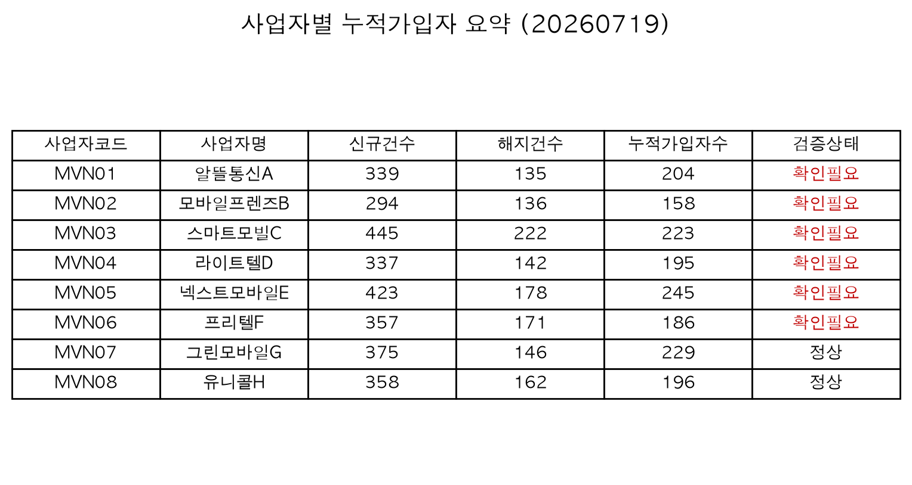

# MVNO 실적 데이터 검증 및 리포트 자동화 프로젝트

> ⚠️ 본 프로젝트는 포트폴리오 목적으로 제작되었으며, 모든 데이터는 100% 더미(가상)입니다.
> 실제 회사명, 파트너명, 상품명, 컬럼명을 사용하지 않았습니다.

## 배경

통신사 MVNO 사업 운영 환경에서 발생할 수 있는 반복적인 실적 검증 업무를 가상의 시나리오로
구성했습니다. 포털 실적 파일, RAW 데이터, 상품 매핑 기준표가 별도로 존재한다고 가정하고,
사람이 수기로 비교하던 데이터 정합성 확인 과정을 Python 스크립트로 자동화했습니다.

다루는 검증 시나리오는 다음 4가지입니다.

- 실시간 실적 공지 (포털 실적 vs RAW 데이터 대사)
- 요금제/상품 미매핑 현황 점검
- 사업자별 누적 가입자 집계 (규제기관 제출용)
- 실적 요약 이메일 공지 (고정 문구 + 요약 이미지·엑셀 첨부)

## 검증 리포트 구성

단순 집계표가 아니라 "어떤 데이터가 왜 이상한지"가 드러나도록, Excel 리포트를 5개 시트로 구성했습니다.

| 시트 | 내용 |
|---|---|
| 요약 | 검증 기준일, 실적비교 정상/확인필요 건수, 오류유형별 건수, 전체 누적가입자수 |
| 실적비교 | 포털 vs RAW를 사업자/상품 단위로 대사한 전체 내역 (차이·차이율·검증상태 포함) |
| 요금제미매핑이슈 | 매핑누락/중복/비활성사용/명칭불일치 4종을 상품코드·오류유형·상세내용으로 통합 |
| 오류상세 | 실적비교 이상 항목 + 매핑 이슈 전체를 하나의 오류 목록으로 합친 시트 |
| 사업자별누적가입자 | 사업자별 신규/해지/누적가입자수 + 검증상태(정상/확인필요) |

이상 항목은 빨간 배경으로 강조되며, 텍스트 요약과 PNG 이미지에도 같은 검증상태가 함께 표시됩니다.

## 이메일 초안 자동 생성

실무에서는 매번 같은 문구("안녕하십니까, OOO팀입니다. ~마감 실적 공유드립니다. 감사합니다.")로
요약 스크린샷과 엑셀 파일을 첨부해 메일로 공지하는 작업이 반복됩니다. 이 프로젝트는 제목·본문·첨부까지
채워진 `.eml` 파일을 생성해서 메일 클라이언트(Outlook, Mail 등)에서 더블클릭하면 바로 '보내기'만
누르면 되는 상태로 만들어 줍니다.

실제 SMTP 발송/사내 메일 인증정보 연동은 의도적으로 넣지 않았습니다. 자격증명을 코드에 두는 것도
위험하고, 자동으로 실제 메일이 발송되는 것도 사람이 확인 없이는 위험한 동작이라 판단했습니다.
(실제 원클릭 발송은 이후 웹서비스화 단계에서 발송 버튼 UI를 통해 붙일 계획입니다.)

## TODO (진행 중)

- [x] 더미데이터 생성기 구현
- [x] 당월 누적 집계 로직 구현
- [x] 포털-RAW 비교 로직 구현
- [x] 매핑 검증 로직 구현 (누락/중복/비활성/명칭불일치)
- [x] Excel 검증 리포트 생성
- [x] txt 요약 생성
- [x] 요약 이미지(PNG) 생성
- [x] 파이프라인 통합 (main.py)
- [x] 테스트 작성
- [x] 실행 결과 스크린샷 및 최종 설명 추가
- [x] 실적 요약 이메일 초안(.eml) 자동 생성
- [ ] 웹서비스화: 발송 버튼 UI + 실제 메일 발송 연동 (2단계)

## 기술 스택

- Python 3.11+
- pandas, numpy (데이터 처리 및 더미데이터 생성)
- openpyxl (Excel 리포트 생성 및 스타일링)
- matplotlib / Pillow (요약 이미지 생성)
- pytest (검증 로직 테스트)
- (확장) FastAPI + Vercel (웹 서비스화, 2단계)

## 폴더 구조

```
mvno-report-automation/
├── README.md
├── requirements.txt
├── config.py
├── data/
│   ├── portal/       # 포털 실적 Excel 더미
│   ├── raw/          # RAW 데이터 CSV 더미
│   └── mapping/       # 요금제/상품 매핑 기준표 Excel 더미
├── docs/
│   └── screenshots/   # README에 넣는 실행 결과 캡처본
├── src/
│   ├── generate_dummy_data.py
│   ├── aggregate.py
│   ├── compare.py
│   ├── validate.py
│   ├── report_builder.py
│   ├── summary_writer.py
│   ├── image_builder.py
│   └── email_writer.py
├── output/            # 실행 결과물 (xlsx, txt, png, eml)
├── main.py
└── tests/
    ├── test_validate.py
    └── test_email_writer.py
```

## 실행 방법

```bash
pip install -r requirements.txt
python main.py --generate-dummy --asof 2026-07-19   # 더미데이터 생성 + 전체 파이프라인 실행
python main.py --asof 2026-07-19                     # 기존 더미데이터로 재실행
python -m pytest tests/ -v                           # 검증 로직 테스트
```

실행하면 `output/` 아래에 `validation_report_YYYYMMDD.xlsx`, `summary_YYYYMMDD.txt`,
`summary_YYYYMMDD.png`, `email_draft_YYYYMMDD.eml` 네 산출물이 생성됩니다.

## 실행 결과

`python main.py --asof 2026-07-19` 실행 시 콘솔 출력 (더미데이터: 사업자 8곳, 상품 63개, RAW 거래 5,000건 기준):

```text
[실적 검증 요약 - 2026.07.19 기준]
- 실적 비교: 총 67건 중 확인필요 12건 (임계치 1.0% 초과 또는 한쪽에만 존재)
- 요금제 미매핑 이슈: 총 20건 (중복 매핑 6건 / 비활성 상품 사용 6건 / 매핑 누락 4건 / 상품명 불일치 4건)
- 사업자별 누적가입자:
  · 알뜰통신A: 204명 [확인필요]
  · 모바일프렌즈B: 158명 [확인필요]
  · 스마트모빌C: 223명 [확인필요]
  · 라이트텔D: 195명 [확인필요]
  · 넥스트모바일E: 245명 [확인필요]
  · 프리텔F: 186명 [확인필요]
  · 그린모바일G: 229명 [정상]
  · 유니콜H: 196명 [정상]
※ 상세 내역은 첨부 엑셀 참고

엑셀 리포트: output/validation_report_20260719.xlsx
텍스트 요약: output/summary_20260719.txt
요약 이미지: output/summary_20260719.png
이메일 초안: output/email_draft_20260719.eml
```

`email_draft_20260719.eml`을 메일 클라이언트에서 열면 아래처럼 제목·본문·첨부가 이미 채워져 있어
'보내기'만 누르면 됩니다.

```text
제목: [MVNO 전략팀] 7월 19일 마감 실적 공유드립니다

안녕하십니까, MVNO 전략팀입니다.

(위 실적 검증 요약 텍스트가 그대로 본문에 들어갑니다)

감사합니다.

첨부: validation_report_20260719.xlsx, summary_20260719.png
```

`output/summary_20260719.png` (Teams 공유용 요약 이미지, 확인필요 사업자는 빨간 글씨로 강조):



`validation_report_20260719.xlsx`의 `오류상세` 시트 일부 (실적비교 이상 항목 + 매핑 이슈를 한 곳에 통합):

| 오류유형 | 사업자코드 | 사업자명 | 상품코드 | 상품명 | 상세내용 |
|---|---|---|---|---|---|
| 포털-RAW 실적 불일치 | MVN03 | 스마트모빌C | PRD010 | 5G 데이터 010 | RAW에만 존재 |
| 포털-RAW 실적 불일치 | MVN06 | 프리텔F | PRD029 | 시니어 요금제 029 | RAW에만 존재 |
| 포털-RAW 실적 불일치 | MVN03 | 스마트모빌C | PRD034 | 시니어 요금제 034 | 순증건수 차이 -4건 (차이율 33.33%) |
| 포털-RAW 실적 불일치 | MVN06 | 프리텔F | PRD053 | 청소년 요금제 053 | 순증건수 차이 -8건 (차이율 30.77%) |

## 시나리오 대응 관계

| 검증 시나리오 | 프로젝트 기능 |
|---|---|
| 실시간 실적 공지 | 포털 vs RAW 비교 리포트 (compare.py → 실적비교/오류상세 시트) |
| 요금제 미매핑 현황 | 매핑 검증 4종 (validate.py → 요금제미매핑이슈/오류상세 시트) |
| 규제기관 제출자료(사업자별 누적가입자) | 당월 누적 집계 (aggregate.py → 사업자별누적가입자 시트) |
| 실적 요약 이메일 공지 | 이메일 초안 자동 생성 (email_writer.py → .eml 파일) |

## 설명 포인트 (요약)

- 사람이 수기로 하던 포털-RAW 대사 작업을 pandas 기반 자동 검증 로직으로 재구성
- 매핑 무결성(누락/중복/비활성/명칭불일치) 검증 로직 직접 설계, 4종 결과를 공통 스키마로 통합
- 실적비교 + 매핑이슈를 하나로 합친 오류상세 시트로 "어떤 데이터가 왜 이상한지"를 한 번에 확인 가능
- openpyxl로 5개 시트 구성의 Excel 리포트, matplotlib으로 상태값이 강조된 요약 이미지까지 자동 생성
- 반복 발송되던 실적 공지 메일까지 초안(.eml) 자동 생성으로 재현하되, 자격증명이 필요한 실제 발송은
  의도적으로 범위에서 제외 (보안/오발송 리스크를 고려한 설계 판단)
